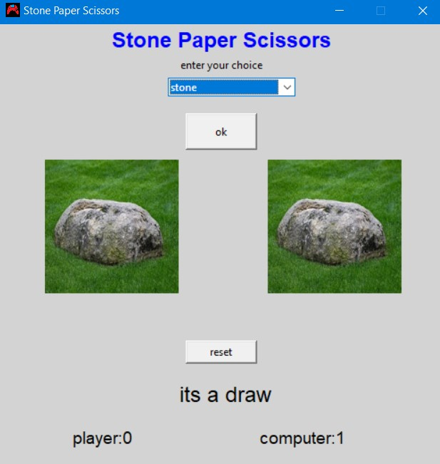

# stone-paper-scissor

its a simple stone paper scissor game made using graphical interface in python using tkinter and PIL(Python Imaging Library)

## Installation

1. Clone the repo

```bash
git clone https://github.com/Sivakumar001/stone-paper-scissor.git
```

2. To run the code you need to install [pillow](https://pypi.org/project/Pillow/) or use this command to install the requirments in the project folder 

```bash
pip install requirments.txt
```

the output image is displayed here:




## Contribution

pull request are welcome. for major changes, please open an issue first to discuss what you would like to change.

if you like my project star my repo and feel free to check my other projects too.. :)
